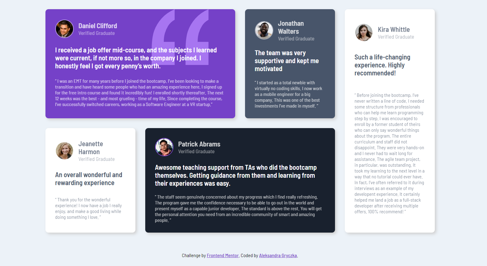
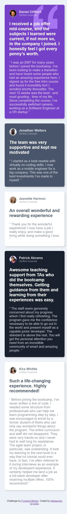

# Frontend Mentor - Testimonials grid section solution
This is a solution to the [Testimonials grid section challenge on Frontend Mentor](https://www.frontendmentor.io/challenges/testimonials-grid-section-Nnw6J7Un7) Frontend Mentor challenges help you improve your coding skills by building realistic projects.
## Table of contents
- [Overview](#overview)
  - [The challenge](#The-challenge)
  - [Screenshot](#Screenshot)
  - [Links](#Links)
- [My process](#My-process)
  - [Built with](#Built-with)
- [Author](#Author)

## Overview
### The challenge
Users should be able to:

- View the optimal layout depending on their device's screen size

### Screenshot

## Links
- Solution URL: [Github](https://github.com/Emmettek/testimonials-grid-section)
- Live Site URL: [Github Pages](https://emmettek.github.io/testimonials-grid-section/)

## My process
### Built with
- Semantic HTML5 markup
- CSS custom properties
- SASS
- BEM Methodology
- Flexbox
- CSS Grid
- Mixin
- Visual Studio Code

## Author
- LinkedIn - [@gryczkaleksandra01](https://www.linkedin.com/in/gryczkaleksandra01/)
